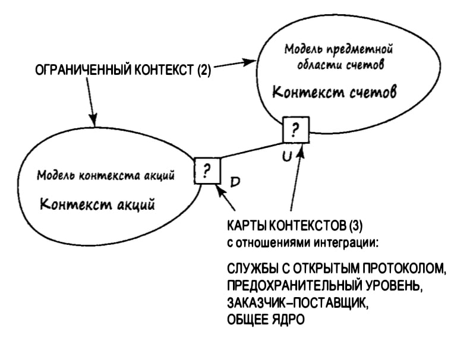
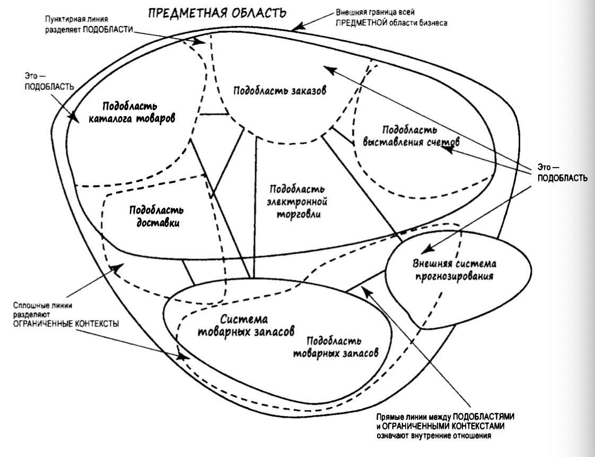

#### ОСНОВНЫЕ ПОНЯТИЯ DDD

---

Для того чтобы уравнять разработчиков и экспертов предметной области, чтобы было гораздо проще обмениваться полезными
знаниями о предметной области, подход DDD предлагает применять общий набор терминов, понятий и фраз, который будет

использоваться в общении между членами команды, и который позже отразится в исходном коде результирующей программы.

**Домен, предметная область** - это сфера деятельности, в которой решается определенная проблема.

**Доменная модель** - это модель предметной области, которая описывает ее основные понятия и взаимосвязи между ними.

**Смысловое ядро** - подобласть, которая имеет первостепенное значение для организации,
наиболее важные понятия и взаимосвязи между ними в ограниченном контексте.

Основной целью применения DDD является получение высококачественной модели программного обеспечения,

которая будет максимально точно отражать поставленные бизнес-цели. Для реализации этого требуется объединение усилий
как разработчиков, так и экспертов в предметной области. Создание дружной и сплоченной команды позволяет получить
большое количество преимуществ для бизнеса. Обмен знаниями между членами команды снижает шансы появления
«тайного знания» о модели, достигается консенсус между экспертами предметной области в отношении различных понятий
и терминологии, разрабатывается более точное определение и описание самого бизнеса.

#### Общая картина DDD

---

**Единый(вездесущий язык, ubiquitous Language)** - это язык (термины и опредления), который используется всеми участниками
проекта,включая заказчика и разработчиков(выработанный командой)

**Ограниченный контекст** - это часть доменной модели, которая решает определенную проблему, которая отображет единый язык
в модель программного обеспечения. Ограниченный контекст это концептуальная граница применимости модели предметной области.
Как пример, это может быть система скидок, система доставки, система оплаты и т.д., которые вместе образуют доменную модель.



- в каждом огранниченном контексте существует только один единый язык
- язык является единым только в рамках команды, работающей над проектом в едином ограниченном контексте.
- меньше чем может показаться на первый взгляд. ограниченный контекст достаточно велик только для
  единого языка изолированной предметной области, но не больше.

***Единый язык применяется внутри ограниченного контекста. Стратегически програмные модели должны отображать точный единый язык внутри ограниченного контекста.***

**Архитектура** - способ организации кода для отражения модели предметной области. Стратегические и тактические модели должны быть архитектурно нейтральными, но следует делать упор на модели предметной области, архитектурные веяния приходят и уходят

**Тактическое Моделирование** - осуществляется внутри ограниченного контекстас помощью шаблонов структурных элементов(аргегат, объекты значения, сущности)

Агрегат состоит из отдельной сущности или из кластера сущностей и объектов значений, которые должны быть транзакционно согласованны(в рамках одной транзакции в `ограниченном контексте` должно происходить изменение только одного `агрегата`)

**Хранилище(репозиторий)** - то, что хранит агрегат

**Служба** - для выполнения операций, которые нельзя ??выразить в посредством операций над сущщностью или объектом значения
например для логики которая пересекает границы агрегата

**События предметной области** - это события, которые происходят в предметной области, например, заказ был оплачен, заказ был доставлен, заказ был отменен и т.д.
события могут публиковаться агрегатами

**Модули** - например пакет в го, должен соотвестсовать единому языку

**Анемичная модель предметной области** - это модель, которая содержит только данные, но не содержит логику.

достоинства анемичной модели:

- Анемичная модель является более тестируемой
- Обработку данных модели можно разделить между нескеолькими слоями, расширить модель более просто, тк бизнес логика находится в разных компонентах

недостатки анемичной модели

- бизнес логика разделена между слоями и классами, что может привести к усложнению понимания и поддержки
- отсутсвие инкапсуляции - бизнес логика может быть доступна везде

**Богатая модель предметной области** - это модель, которая содержит данные и логику и является самодостаточной в рамках ограниченного контекста.

достоинства богатой модели

- более чистый и структурированный код из-за инкапсуляции, тк поведение завязано на класс
- единообразие - операции связанные с объектом находятся в самом объекте
- низкая связанность между объектами

недостатки

- более сложна для понимания и разработки при наличии сложной бизнес логики
- объекты богатой модели могут быть слишком громоздки потому что несут много отвественности, тестировать их сложно

Эванс и Фаулер рекомендуют использовать богатую модель предметной области, и считают анемичную модель антипаттерном, хотя использование той или иной модели предметной обасти зависит от контекста. Анемичная модель более соотствует принципам SOLID

#### Сложность предметной области:

---

ддд используют в самых важных местах, потому что полная его реализация затратная. По этому такая модель называется: смысловое ядро (core domain) - самый важный проектный шаблон и СЛУЖЕБНЫЕ ПОДОБЛАСТИ (SUP­PORTING SUВDOМAINS) - второй по важности шаблон

**сложность** - что именно является сложным - решает бизнес. Для определения сложности можно пользоваться специальными таблицами (например, кол-во юзкейсов больше 40, приложение будет точно меняться в течение нескольких лет и степень изенений точно непонятна, планируется работа с эскпертами предметной области, сложная для понимания область и тд)

Вернон утверждает, что если модель содержит геттеры и сеттеры для полей, а вся бизнес логика построенна на вызовах геттеров и сеттеров, то такая модель - полная фигня и надо все переделать
Связанно это с очень большой сложностью измненений, которые себя никогда не окупят

#### Как применять ДДД?

---

Пример использования единого языка в коде:

"Медсестры назначают пациентам вакцины от гриппа в стандарт­ных дозах".

```go:
vaccine := vaccines.NewStandartAdultFluDose()

nurse.AdministerFluVaccine(patient, vaccine)
```

Пока будет вырабатываться единый язык, будут вестись споры насчет того или иного именования, но это нормально - таким образом вытачивается едииный язык

**Как разработать единый язык?**

- неформальные диаграмы(можно использовать формальное моделирование, но без формальностей)
- Создать глоссарий с простыми определениями и перечистлить перспективные и безперспектиные альтернативы, сопровождая их комментрариями о причинах оценки
- критика и непониманию со стороны НЕ-экспертов членов команды приведут к редактированию глоссария

Эти шаги будут только началом, единый язык выработается в следствие модификации, термины будут устаревать и дополняться. По итогу в КОДЕ будут выраженны только самые устойчивые выражения единого языка. В дальнейшем код и речь команды будут состоять из диаграмм и глосария и нужно будет отказаться от глосария и диаграм которую будет трудно обновлять и согласовывать с текущим вариантом единого языка. Отказ это не требование, а рекомендация, потому что менять документацию на соотвествие с кодом будет очень сложно

- единый язык - вездесущий, повсеместный, на котором говорят члены команды и выражается отдельная модель предметной области
- единый, не значит язык промышленности, компании или всего мира
- один контекст - один язык
- ограниченные контексты - небольшие, достаточные для использования единого языка, но не больше
- язык единый только в рамках одной команды, работающей над проектом в ограниченном контексте
- в отдельном проекте всегда существует несколько изолированых ограниченных контекстов соединенных картой контекстов
  каждый из этих контекстов имеет свой язык, даже если некторые термины совпадают
- попытка применить один язык в рамках всего предприятия и еще хуже среди нескольких предприятий закончится провалом

#### Бизнес ценность DDD

---

или
Как продать ДДД руководству?)

1. Организация получит полезнуюм одель своей предметной области.
   акцент делается именно на том, что приносит наибольшую пользу, в центре внимания смысловое ядро, другие модели
   поддерживают его и являются важными, но приоритет у смыслового ядра
2. Будут разработаны точноео пределение и описание бизнеса.
   в результате применения ДДД достигается полное понимание бизнеса и его целей, благодаря тому что модель уточняется,
   возникает более глубокое понимание принципов работы компаниию Например в некоторых компаниях единый язык используется
   и в маркетинге
3. Вразработке программного обеспечения будут принимать участие эксперты в предметной области.
   при выработке единого язка эксперты и новые сотрудники с другим опытом постоянно обмениваются знаниями
   и общаются на едином езыке - это уменьшает риск появления некоего "тайного знания"
4. Пользователи системы повысят свою квалификацию.
   Пользователи преобразовывют знания в данные, но если они не совсем понимают что именно они вводят, это
   может повлиять на качество данных, а значит и на качество системы.
   Часто пользователи просто угадывают что должна делать система, но если квалификация пользователя соотвествует базовым
   контуроам базовой предметной модели, то пользователь может сделать правильные выводы.
5. Модели будут иметь четкие границы (более технические выгоды с 5 по 8 пункты)
   технологический персонал обычно не униывает от необходимости учитывать бизнес ценности, что повышает сложность решаемых задач
   решаемых алгоритмических задач, но ограниченный контекст позволяет сосредоточиться на решении конкретной задачи
6. Будет улучшена архитектура предприятия.
   Команды, меджу моделями которых существуют зависимости могут развернуть карты контекстов, что бы установить формальные отношения
   и способы интегации, это действительно может привести к очень глубокому пониманию архитектуры всего предприятия
7. Будут применяться гибкие, итеративные и непрерывные методы моделирования.
   ддд это не тяжеловесный процесс проектирвания, ДДД не сводится к рисованию диаграмм
   вместо этого происхожит постоянное уточнение ментальной модели експертов и преобразовании в модель для бизнеса
   и при этом можно использовать любой удобный процесс гибкой разработки
   в результате получается модель которая представляющая работающее программное обеспечение, пока модель приносит
   пользу - она уточняется
8. Будут развернуты новые стратегические и тактические инструменты.
   ОГРАНИЧЕННЫЙ КОНТЕКСТ позволяет команде очертить границы, в ракках которых вырабатывается решение конкретной задачи предметной области.
   В рамках отдельного ОГРАНИЧЕННОГО КОНТЕКСТА команда формулирует ЕДИНЫЙ ЯЗЫК. На нем говорят члены команды и формулируется модель программного
   обеспечения. Разношерстные команды, отвечающие за свои ОГРАНИЧЕННЫЕ КОНТЕКСТЫ, используют КАРТУ КОНТЕКСТОВ для стратегического
   разграничения ОГРАНИЧЕННЫХ КОНТЕКСТОВ и выяснения потребности в интеграции. Внутри границ отдельной модели команда
   может развертывать любое количество полезных тактических инструментов для тактического моделирования:
   АГРЕГАТЫ (AGGREGATES)
   СУЩНОСТИ (ENTITIES)
   ОБЪЕКТЫ-ЗНАЧЕНИЯ (OBJECT-VALUES)
   СЛУЖБЫ (SERVICES)
   СОБЫТИЯ ПРЕДМЕТНОЙ ОБЛАСТИ (DOМAIN EVENTS ) и тд

#### Проблемы применения ДДД

---

- Для создания ЕДИНОГО ЯЗЫКА нужны время и усилия.
- В проекте изначально и постоянно должны принимать участие эксперты в
  предметной области.
- Для решения проблем предметной области разработчики должны изменить способ мышления.

#### Обоснование модели предметной области

Тактическое моделирование сложнее стратегического
Можно использовать облегченную версию ДДД, которая подразумевает использование набора такктических шаблонов
без должного внимания к выработке единого языка, при этом обычно принебрегают ограниченным контекстом
и картой ограниченных контекстов, что приводит к решению только технических проблем

## Предметные области и ограниченные контексты




пример суждения терминов в разных огранииченных контекстах
напрмир в подобласти заказов - тетрмин клиент находится в контексте предыдущих покупок, карт лояльности 
доступных товаров и тд
Но когда клиент уже оформил заказ, смысл термина сужается - он сводится к фамилии, адресу доставки, сумме
и времени доставки 


#### СМЫСЛОВОЕ ЯДРО - (подобласть)
имеет первостепенное значение для организаци, со стратегической точки зрения бизнес должен выделяться
своим смысловым ядром, которое отличает его от конкурентов, этот проект должен получать высший приоритет

подобласть может состоять 
- **пространства задач**(части предметной области, которые необходимо выделить чтобы создать новое СМЫСЛОВОЕ ЯДРО)
  исследование пространства задач подразумевает изучение подобластей которые уже существуют и которые 
  должны существовать
- **пространство решений** состоит из одного или нескольких ограниченных контекстов, набора конктерных
   моделей программного обеспечения


# 🧠 Типы связей между Bounded Context-ами (DDD, стратегические паттерны)

## Контекст
Мы обсуждаем **стратегические паттерны взаимодействия между Bounded Context-ами**.  
**Bounded Context** — это стратегический паттерн сам по себе,  
а **связи между ними** — это то, *как они координируются, влияют друг на друга или защищаются*.

---

## 1. Shared Kernel

> По сути, то, что может разделяется одинаково между контекстами.

**Просто:**  
"Мы используем одну и ту же структуру, и если кто-то меняет её — мы оба страдаем".

📌 Используется:
- Общая модель: `UserID`, `AuditFields`, `BaseEvent`.
- Вы готовы **вместе поддерживать и договариваться**.

⚠️ Опасность:
- Малейшее изменение в одном месте может развалить другой контекст.

💬 Метафора:  
`Shared Kernel — это брак. Развод стоит дорого. Входи только если доверяешь.`

---

## 2. Customer–Supplier

> Когда поставщик данных предоставляет данные в ожидаемом потребителем формате.

**Просто:**  
"Я пользуюсь твоим API, но ты идёшь мне навстречу, если мне нужно что-то изменить".

📌 Используется:
- Один контекст обслуживает другой (например, "Каталог" → "Корзина").
- Supplier может учитывать потребности кастомера.

⚠️ Риски:
- Если доверие ломается — превращается в Conformist.

💬 Метафора:  
`Customer–Supplier — это про влияние. Если ты Customer — у тебя есть голос.`

---

## 3. Conformist

> Когда структура принимается как есть без изменений.

**Просто:**  
"Они дали — я использую как есть. Не могу диктовать условия".

📌 Используется:
- Интеграция с внешними API (например, банк).
- Никакого влияния, только адаптация.

⚠️ Всё, что сломают — ты разгребаешь.

💬 Метафора:  
`Conformist — ты просто клиент. Не ноешь. Пишешь адаптер. Живи.`

---

## 4. Anti-Corruption Layer (ACL)

> Когда ты строишь явный слой защиты от внешней модели.

**Просто:**  
"Они шлют своё говно, а я строю адаптер, чтобы оно не засрало мою модель".

📌 Используется:
- При интеграции с кривыми или чужими системами.
- Обязательно преобразование внешней модели во внутреннюю.

⚠️ В отличие от Conformist — ты **не тащишь чужую модель** внутрь.

💬 Метафора:  
`ACL — твой межконтекстный фаервол. Не пускай чужие тараканы в дом.`

---

## 5. Open Host Service

> Контекст предоставляет публичный API как стабильную точку входа.

**Просто:**  
"Вот API, пользуйтесь. Не под каждого, а один на всех".

📌 Используется:
- Сервис предоставляет универсальный интерфейс (например, платежный шлюз).
- Любой клиент может подключиться.

⚠️ Клиенты такого API — Conformist’ы.

💬 Метафора:  
`Open Host — твоя стойка регистрации. Всем ясно, куда приходить и как говорить.`

---

## 6. Published Language

> Общий язык общения: события, схемы, контракты.

**Просто:**  
"Мы говорим на одном языке, чтобы не путаться".

📌 Используется:
- Event-driven архитектура, pub/sub.
- Общие JSON-схемы, protobuf, GraphQL, OpenAPI.

⚠️ Главное — договориться не только о формате, но и о **смысле** полей.

💬 Метафора:  
`Published Language — общий словарь. Меньше недопонимания — меньше боли.`

---

## 📋 Таблица на память
| Тип                | Изолируем свою модель? | Комментарий                                    |
| ------------------ | ---------------------- | ---------------------------------------------- |
| Shared Kernel      | ❌                      | Модель общая — изменения влияют на всех        |
| Customer–Supplier  | 🔸 Иногда              | Зависимость есть, но влияние возможно          |
| Conformist         | ❌                      | Принимаешь модель как есть                     |
| ACL                | ✅                      | Построен адаптер, чтобы изолироваться          |
| Open Host Service  | ❌                      | Это ты поставляешь API — защита не требуется   |
| Published Language | ❌                      | Все говорят на общем языке — изоляция не нужна |

---

## Пример Published Language в микросервисах

- JSON Schema — формат сообщений по REST
- Protobuf — gRPC между сервисами
- Avro / Thrift — Kafka сообщения
- OpenAPI/Swagger — общие API контракты
- Event schemas — `OrderCreated`, `UserRegistered`

📌 Главное: **все участники понимают одно и то же под одними и теми же полями.**
